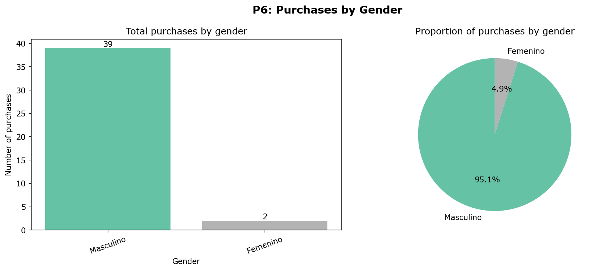

# Individual Statistical Report - Bianca Acosta

## P6: Which gender makes more purchases on the platform?

**Author:** Bianca Acosta
**Run timestamp:** 2026-07-08 06:50:44

### Hypotheses
- **H0:** Student gender and purchase action are independent.
- **H1:** Student gender and purchase action are associated.
- **Significance level (α):** 0.05

### Methodology
Chi-Square Test of Independence (`scipy.stats.chi2_contingency`) over the
gender x action (purchase / no_purchase) contingency table. Raw data was
extracted from Supabase (read-only) and cleaning/augmentation was performed
locally, in memory, without writing anything to the database.

## Primary Analysis: Real Data

### Descriptive summary

| Gender | Total purchases | Percentage |
|---|---|---|
| Masculino | 39 | 95.12% |
| Femenino | 2 | 4.88% |

### Contingency table (observed)

| Gender | Purchase | No Purchase |
|---|---|---|
| Femenino | 2 | 6 |
| Masculino | 39 | 68 |

### Statistical test result

| Statistic | Value |
|---|---|
| Chi-Square (χ²) | 0.0726 |
| Degrees of freedom | 1 |
| p-value | 0.787545 |
| Minimum expected cell frequency | 2.85 |

### Robustness check: Fisher's Exact Test
The Chi-Square test is an asymptotic approximation that assumes expected cell
frequencies of at least 5. With a small sample, this assumption can be
violated, which can make the Chi-Square p-value unreliable. Fisher's Exact
Test computes the exact probability instead of relying on that approximation,
and is the recommended alternative for small 2x2 contingency tables.

| Statistic | Value |
|---|---|
| Fisher's Exact Test p-value | 0.709681 |
| Odds ratio | 0.5812 |

### Conclusion (real data — primary finding)
H0 is not rejected: there is not enough statistical evidence to state that gender is associated with the probability of purchase (p-value = 0.787545 >= alpha = 0.05).

---

## Secondary Analysis: Data Augmentation (SIMULATED DATA)

> **Disclosure:** the platform currently has very few registered users, which
> limits the statistical power of the Chi-Square test on real data alone (see
> the minimum expected cell frequency above). To demonstrate the test with
> adequate power, this section blends the real, cleaned dataset with
> **simulated purchase events**, generated via a Bernoulli simulation seeded
> with each gender's **real observed purchase rate** (not an arbitrary or
> desired outcome). A fixed random seed guarantees reproducibility. This
> augmented result is a **secondary, clearly labeled robustness check** —
> it does **not** replace or get merged with the real-data result above,
> which remains the primary, authoritative finding of this analysis. See
> `augment_with_simulated_data()` in `bianca_analysis.py` for the exact
> simulation method.

### Descriptive summary (augmented)

| Gender | Total purchases | Percentage |
|---|---|---|
| Masculino | 77 | 73.33% |
| Femenino | 28 | 26.67% |

### Contingency table (augmented)

| Gender | Purchase | No Purchase |
|---|---|---|
| Femenino | 28 | 80 |
| Masculino | 77 | 130 |

### Statistical test result (augmented)

| Statistic | Value |
|---|---|
| Chi-Square (χ²) | 3.5666 |
| Degrees of freedom | 1 |
| p-value | 0.058954 |
| Minimum expected cell frequency | 36.0 |
| Fisher's Exact Test p-value | 0.045175 |

### Conclusion (augmented)
H0 is not rejected: there is not enough statistical evidence to state that gender is associated with the probability of purchase (p-value = 0.058954 >= alpha = 0.05).
