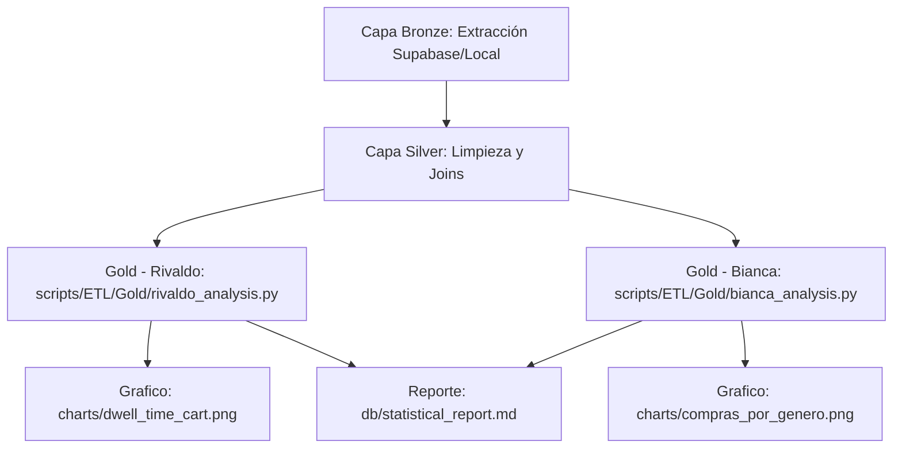

# Plan de Análisis Estadístico y Validación de Hipótesis

Este documento detalla el diseño analítico y la metodología de validación de hipótesis correspondientes al equipo de **Analítica y Validación Estadística** para la entrega de **Project #06**.

Con el objetivo de trabajar de forma aislada y limpia en Git sin provocar conflictos, el trabajo se dividirá en módulos independientes:
1. **Rivaldo Canché** implementará su análisis en `scripts/ETL/Gold/rivaldo_analysis.py`.
2. **Bianca Acosta** implementará su análisis en `scripts/ETL/Gold/bianca_analysis.py`.

---

## 1. Módulo Analítico de Rivaldo Canché
**Pregunta de Investigación 5 (P5):** ¿Cuál es el dwell time (tiempo de permanencia) promedio por categoría antes de añadir un producto al carrito?

### Hipótesis a Evaluar:
Los productos de tipo **Académico** requieren un mayor tiempo de evaluación y comparación (mayor dwell time) antes de que el estudiante decida añadirlos al carrito, en comparación con los productos de tipo **Leisure** (ocio).

### Metodología Estadística de Validación:
Para comparar los promedios de tiempo entre los dos grupos independientes (Académico y Leisure), se aplicará una **Prueba t de Student para muestras independientes** (usando `scipy.stats.ttest_ind` en Python). 

* **Variable Dependiente:** `dwell_time_segundos` (continua).
* **Variable Independiente (Grupo):** `categoria_general` ("Académico" vs. "Leisure").
* **Planteamiento de Hipótesis:**
  * **Hipótesis Nula ($H_0$):** $\mu_{\text{Académico}} = \mu_{\text{Leisure}}$ (No hay diferencia significativa en el dwell time promedio antes de añadir al carrito entre ambas categorías).
  * **Hipótesis Alternativa ($H_1$):** $\mu_{\text{Académico}} \neq \mu_{\text{Leisure}}$ (Existe una diferencia estadísticamente significativa en el dwell time promedio antes de añadir al carrito entre ambas categorías).
* **Nivel de Significancia ($\alpha$):** $0.05$ (confianza del 95%).
* **Criterio de Decisión:** Si el p-value resultante es menor que $0.05$, se rechazará la hipótesis nula ($H_0$), confirmando que la categoría del producto influye de manera estadísticamente significativa en el tiempo que le toma al estudiante tomar la decisión de compra.

### Visualización Planificada:
Se generará un gráfico de tipo **Boxplot (diagrama de caja y bigotes)** guardado en `charts/dwell_time_cart.png`, el cual permitirá observar la distribución de los tiempos de evaluación, la mediana, los cuartiles y los posibles valores atípicos (outliers) en ambos grupos.

---

## 2. Módulo Analítico de Bianca Acosta
**Pregunta de Investigación 6 (P6):** ¿Qué género realiza más compras en la plataforma?

### Hipótesis a Evaluar:
No existe una diferencia estadísticamente significativa en el volumen de compras de los estudiantes en función de su género (las compras ocurren de forma proporcional a la distribución de géneros que navegan en la tienda).

### Metodología Estadística de Validación:
Para determinar si existe una asociación entre dos variables categóricas (género del usuario y realización de una compra), se utilizará una **Prueba de Chi-cuadrado de Independencia** (usando `scipy.stats.chi2_contingency` en Python).

* **Variable A:** `genero` ("Masculino", "Femenino", "No binario", etc.).
* **Variable B:** `tipo_evento` ("purchase" vs. "no_purchase", o conteo total de compras).
* **Planteamiento de Hipótesis:**
  * **Hipótesis Nula ($H_0$):** El género del estudiante y la acción de compra son independientes (no hay asociación significativa entre género y compra).
  * **Hipótesis Alternativa ($H_1$):** El género del estudiante y la acción de compra están asociados (el género influye de forma significativa en la probabilidad de comprar).
* **Nivel de Significancia ($\alpha$):** $0.05$.

### Visualización Planificada:
Se creará un gráfico de **Barras Apiladas o Gráfico de Pastel** en `charts/compras_por_genero.png` que muestre la proporción de transacciones exitosas completadas por cada género demográfico.

---

## 3. Plan de Integración en el Flujo ETL
Una vez que el equipo de Ingeniería de Datos finalice la limpieza de la capa **Silver**, ambos scripts analíticos se ejecutarán al final del pipeline:

