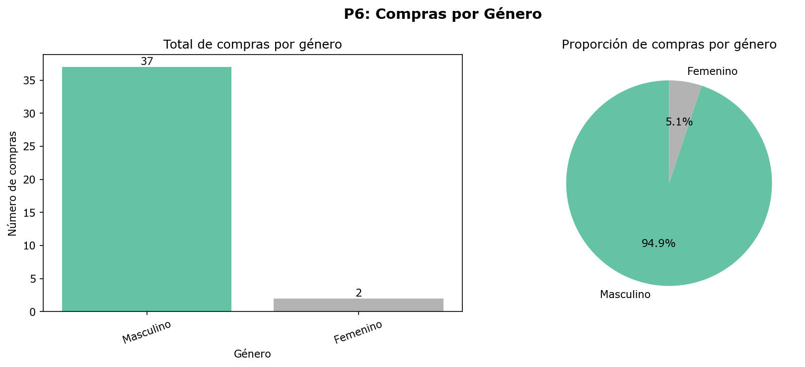

# Reporte Estadístico Individual - Bianca Acosta

## P6: ¿Qué género realiza más compras en la plataforma?

**Autora:** Bianca Acosta
**Fecha de ejecución:** 2026-07-03 19:47:05

### Hipótesis
- **H0:** El género del estudiante y la acción de compra son independientes.
- **H1:** El género del estudiante y la acción de compra están asociados.
- **Nivel de significancia (α):** 0.05

### Metodología
Prueba de Chi-cuadrado de Independencia (`scipy.stats.chi2_contingency`) sobre
la tabla de contingencia género x acción (purchase / no_purchase). Los datos
crudos se extrajeron de Supabase (solo lectura) y la limpieza/aumentación se
realizó localmente, en memoria, sin escribir nada en la base de datos.

### Resumen descriptivo

| Género | Total de compras | Porcentaje |
|---|---|---|
| Masculino | 37 | 94.87% |
| Femenino | 2 | 5.13% |

### Tabla de contingencia (observada)

| Género | Purchase | No Purchase |
|---|---|---|
| Femenino | 2 | 5 |
| Masculino | 37 | 56 |

### Resultado de la prueba estadística

| Estadístico | Valor |
|---|---|
| Chi-cuadrado (χ²) | 0.0342 |
| Grados de libertad | 1 |
| p-value | 0.853373 |

### Conclusión
No se rechaza H0: no hay evidencia estadística suficiente para afirmar que el género esté asociado a la probabilidad de compra (p-value = 0.853373 >= alpha = 0.05).

